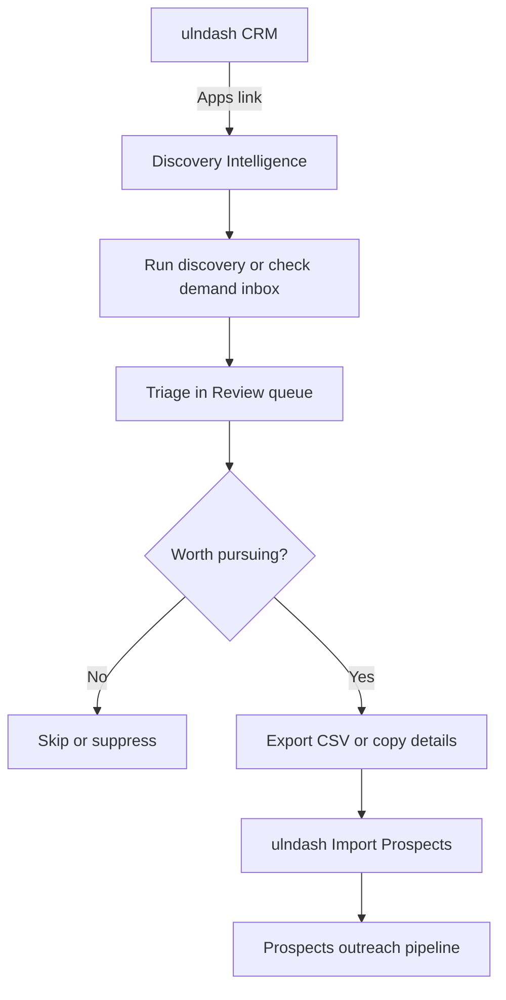

# Discovery Intelligence — Operator Playbook

Discovery Intelligence is **Demand Capture** ([`discovery/`](../discovery/)), opened from ulndash via **Apps → Discovery Intelligence**.

ulndash remains your primary CRM. Use Discovery for outbound research and qualification; import qualified leads into **Prospects** for outreach.

---

## Quick start (local)

### 1. Run ulndash

```powershell
cd C:\xampp\htdocs\ulnovatech
npm run dev
# CRM: http://localhost:5174/ulndash/
```

Ensure XAMPP **Apache + MySQL** are running.

### 2. Run Demand Capture

```powershell
cd C:\xampp\htdocs\ulnovatech\discovery
pnpm install
cp .env.example .env   # set DATABASE_URL for local Postgres
pnpm db:migrate
pnpm dev
# Discovery: http://localhost:3000
```

Or from repo root:

```powershell
npm run discovery:db:migrate
npm run dev:discovery
```

For discovery runs to complete, also run the job worker in a second terminal:

```powershell
npm run discovery:jobs:worker
# or: cd discovery && pnpm jobs:worker
```

Configure **Google Places API** (minimum) via Settings → API credentials in the Demand Capture UI, or see [`discovery/docs/SETUP_RESOURCES.md`](../discovery/docs/SETUP_RESOURCES.md).

### 3. Open from ulndash

Sidebar → **Apps → Discovery Intelligence** (opens in a new tab).

Dev URL is set in `ulndash/frontend/.env.development`:

```env
VITE_DISCOVERY_URL=http://localhost:3000
```

---

## Daily workflow



### Step 1 — Find leads (Discovery)

In Demand Capture:

1. **Discovery** (`/discovery`) — start a geo + industry run (standard profile for normal use).
2. **Demand inbox** (`/intent/inbox`) — paste/RSS/Reddit signals (optional).
3. Wait for the worker to finish pipeline stages (discover → enrich → score).

### Step 2 — Triage (Discovery)

1. Open **Review** (`/review`) — unified work queue.
2. Open opportunity briefs; reject low-fit leads.
3. Promote strong fits to pursuits only if you plan to use Discovery’s outreach tools; for ulndash-centric workflow, export instead (Step 3).

### Step 3 — Hand off to ulndash Prospects

**Option A — Outreach CSV export (recommended)**

1. In Demand Capture **Outreach**, export CSV for reviewed leads.
2. Export columns: `business`, `email`, `phone`, `subject`, `body`, `maps_url`.
3. In ulndash: **Prospects → Import** (`/import/prospects`).
4. Upload the CSV. The importer automatically:
   - maps `business` → `name`
   - sets `source` → `Discovery Intelligence`
   - merges `subject`, `body`, `maps_url`, `website` into `notes`

**Option B — Manual template**

Download the template from Import Prospects or use:

`ulndash/frontend/public/templates/discovery-prospects-template.csv`

Required column: `name`. Recommended: `industry`, `location`, `source`, `priority`, `notes`.

### Step 4 — Outreach (ulndash)

1. Open **Prospects** — filter by `source: Discovery Intelligence`.
2. Use contact actions (phone, WhatsApp, email) or your existing process.
3. Convert qualified prospects to **Companies** when ready.

---

## CSV column mapping reference

| Demand Capture export | ulndash `prospects` field |
|----------------------|---------------------------|
| `business` | `name` |
| `name` | `name` |
| `city` + `country` | `location` |
| `industry` | `industry` |
| `subject`, `body`, `maps_url`, `website` | `notes` (combined) |
| (auto when DC columns detected) | `source` = `Discovery Intelligence` |
| `priority` | `priority` (high \| medium \| low) |
| `status` | `status` (not_contacted \| contacted \| qualified) |

Implementation: `ulndash/backend/controllers/ImportController.php` → `mapProspectImportRow()`.

---

## Production deployment

**Target:** Google Compute Engine VM (Docker Compose) — same host as ulnovatech. See [DEPLOY_GCLOUD.md](./DEPLOY_GCLOUD.md).

Until then, legacy Vercel/Neon instructions remain in [`discovery/docs/DEPLOYMENT.md`](../discovery/docs/DEPLOYMENT.md).

After deploy, set the live URL in ulndash production env:

```env
# ulndash/frontend/.env.production
VITE_DISCOVERY_URL=https://discovery.ulnovatech.store
```

Rebuild ulndash: `npm --prefix ulndash/frontend run build` or full `npm run build`.

### Auth note

v1 uses **two logins**: ulndash (PHP session) and Demand Capture (Clerk in production). This is expected for the federated model. SSO can be added later if needed.

---

## Troubleshooting

| Issue | Fix |
|-------|-----|
| Sidebar link goes to wrong URL | Check `VITE_DISCOVERY_URL` in the env file used at build time |
| Discovery runs stuck | Ensure `pnpm jobs:worker` is running |
| Import: no rows inserted | CSV must have `name` or `business` column per row |
| Import: wrong source | Add `source` column or use Demand Capture export format |
| Two CRMs confusion | Use Discovery only through triage; manage outreach in ulndash Prospects |

---

## Related docs

- [ECOSYSTEM.md](./ECOSYSTEM.md) — monorepo layout
- [`discovery/MONOREPO.md`](../discovery/MONOREPO.md) — pnpm commands
- [`discovery/docs/OPERATING_MODEL.md`](../discovery/docs/OPERATING_MODEL.md) — Demand Capture daily ops
- [`discovery/docs/DEPLOYMENT.md`](../discovery/docs/DEPLOYMENT.md) — legacy Vercel deploy reference
